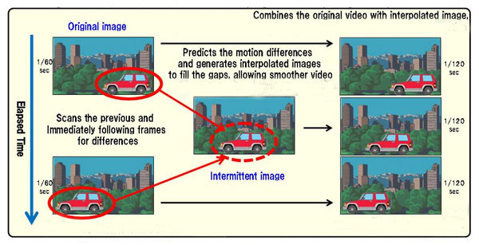

# Frame Interpolation on Densly Sampled Lightfield Images
This project is forked from https://github.com/HyeongminLEE/pytorch-sepconv.git as the starting point.  
## Outline
* [Introduction](#Introduction)
* [Differences from original code](#Differences-from-original-code)
* [Project structure](#Project-structure)
* [Dataset](#Dataset)
* [How to run](#How-to-run)
* [Performance](#Performance)
* [References](#References)
***

### Introduction
Frame interpolation is a classic computer vision problem which tries to generate intermediate animation frames from existing ones to make animation more fluid.  
<p align="center">
    <br>
    <em>Figure 1: Frame interpolation</em>
</p>

This project deploys the Video Frame Interpolation via Adaptive Separable Convolution [1] on the densly sampled lightfield images. Given two frames, it will make use of [adaptive convolution](http://graphics.cs.pdx.edu/project/adaconv) [2] in a separable manner to interpolate the intermediate frame.  

### Differences from original code
The model is split into 2 parts: the `feature_extraction` part and the `separable_convolution` part (the red box in figure 2) for transfer learning.  Also, the pretrained weights are also split into corresponding parts so we can fine-tune them with new data.  
<p align="center">
    
    <em>Figure 2: Separable Convolution Neural Network Architecture</em>
</p>

### Project Structure
`\data`: contains the folders of images to deploy the model on.  
`\images`: containts images in `README.md` and plots of results after doing transfer learning.  
`\model`: contains the code for the network architecture.  
`\scripts`: contains the code for transfer learning (fine-tuning the pretrained weights on new data - `transfer_learning.py`), deploying the model on images taken from the cameras rig (`deploy_camera_rig.py`) or a folder of densly sampled images (`deploy_dslf.py`).  
`\utils`: contains the helper functionalities for the project.  
`\weights`: contains the pretrained weights (after being split) and also the fine-tuned weights.

### Dataset
To run `deploy_dslf.py`, you need to prepare the folder of images with names like *'0001.png'*, *'0002.png'*... in the `\data` directory.  
To run `deploy_camera_rig.py`, you need to prepare the folder of images taken from the cameras rig, which has a structure like this: `\data\camera_rig\Position02\Position02_Camera01.png`.
To run `transfer_learning.py`, you need to prepare the same folder data with when running `deploy_dslf.py`, but then you need to run `\data\data_prepare.py` to split these into proper train and val directories.

### How to run
#### `deploy_dslf.py`
```
cd ./scripts/;
deploy_dslf.py.py [--test_dir TEST_DIR] [--output_dir OUTPUT_DIR]
                  [--weight_path WEIGHT_PATH] [--log_dir LOG_DIR] 
                  [--mode MODE] [--distance DISTANCE] 
                  [--image_extension IMAGE_EXTENSION] 

optional arguments:
    --test_dir TEST_DIR         path to directory that contains input images
    --output_dir                path to the output directory
    --weight_path WEIGHT_PATH   path to directory that contains the pretrained-weight
    --mode MODE                 choose between 'multiple' to deploy on multiple images (default), or 'one' to deploy on just 1 pair of images
    --distance DISTANCE         the distance between 2 images in an input pair. If distance is 4, then interpolate between image '0001.png' and '0005.png'
    --image_extension           the extension of the images in the input folder (default: '.png')
```
After preparing the folder of images *'0001.png'*, *'0002.png'*..., you can run the python file `deploy_dslf.py` to interpolate with the distance you want. For example, if the distance is 4, the algorithm will interpolate between image *'0001.png'* and *'0005.png'* to get the interpolated image *'0003.png'*, *'0005.png'* and *'0009.png'*... to get interpolated *'0007.png'*. After that, the second round will be run, on which the algorithm interpolates images *'0001.png'* and *'0003.png'* to get interpolated *'0002.png'*. After running, the output images will be in the folder specified by `--output_dir`.

#### `deploy_camera_rig.py`
```
cd ./scripts/;
deploy_camera_rig.py.py [--data_dir DATA_DIR] [--output_dir OUTPUT_DIR]
                        [--weight_path WEIGHT_PATH] [--log_dir LOG_DIR] 
                        [--mode MODE] [--distance DISTANCE] 
                        [--image_extension IMAGE_EXTENSION] 

optional arguments:
    --test_dir TEST_DIR         path to directory that contains input images folders
    --output_dir                path to the directory that contains output images
    --weight_path WEIGHT_PATH   path to the pretrained-weight
    --num_output NUM_OUTPUT     the number of desired interpolated images
    --image_extension           the extension of the images in the input folder (default: '.png')
    --resize                    the size in (width, height) of the images to resize to
```

#### `transfer_learning.py`
```
cd ./scripts/;
transfer_learning.py.py [--train_dir TRAIN_DIR] [--val_dir VAL_DIR]
                        [--out_dir OUT_DIR] [--load_model LOAD_MODEL] 
                        [--save_weights SAVE_WEIGHTS] [--save_plots SAVE_PLOTS] 
                        [--image_extension IMAGE_EXTENSION] [--kernel] KERNEL
                        [--epochs EPOCHS] [--batch_size BATCH_SIZE]

optional arguments:
    --train_dir TRAIN_DIR               path to directory that contains images for training
    --val_dir VAL_DIR                   path to the directory that contains images for validation
    --out_dir OUT_DIR                   path to the directory that contains output images
    --load_model LOAD_MODEL             path to the pretrained-weights that we want to fine-tune
    --save_weights SAVE_WEIGHTS         path to the folder to save the fine-tuned weights to
    --save_plots SAVE_PLOTS             path to the folder to save loss and psnr plots
    --image_extension IMAGE_EXTENSION   the image extension of the training images (default: '.png')
    --kernel KERNEL                     the size of the sep_conv kernel (default: 51)
    --epochs EPOCHS                     the number of epochs for transfer learning
```


### Performance 
* Computer spec  
Intel core i7 4.20GHz (8 CPUs), 32Gb Ram.  
GPU: NVIDIA GeForce GTX 1080, 8Gb GPU Memory
* Time  
~45s for deploying 1 folder of 193 images of size (1200, 720) with distance 4.


## References
```
[1]  @inproceedings{Niklaus_ICCV_2017,
         author = {Simon Niklaus and Long Mai and Feng Liu},
         title = {Video Frame Interpolation via Adaptive Separable Convolution},
         booktitle = {IEEE International Conference on Computer Vision},
         year = {2017}
     }
```

```
[2]  @inproceedings{Niklaus_CVPR_2017,
         author = {Simon Niklaus and Long Mai and Feng Liu},
         title = {Video Frame Interpolation via Adaptive Convolution},
         booktitle = {IEEE Conference on Computer Vision and Pattern Recognition},
         year = {2017}
     }
```